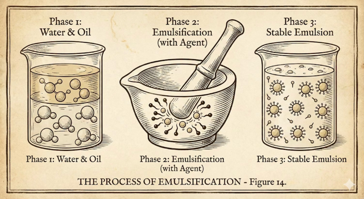

# emulsification process (乳化過程)

乳化過程は, この深ソフトウェア工学において最小単位となるプロセスである.

乳化過程は, 二つの材料 - requirement と context - から executable (分散質) を生成し, 分散媒 (context によってモデル化された社会) に溶け込み, 全体は emulsion (乳液) となる. 分散質は分散媒の中で, 独自の requirement を抱え込んだ多数の小さな粒子となって, 乳化前とは異なる機能を発揮することになる.

乳化過程を促進するために, 古典的ソフトウェア工学では長く硬直化したプロセスを, 後アジャイル・ソフトウェア工学ではひとやチームの濃いコミュニケーションが用いられたが, 現代ではおもに言語モデルの力を借りることになる.

requirement, context は共に何らかの言語による表現の集合である.

executable は何らかの実行可能体 (狭義にはソフトウェアだが, 将来的には概念, 規範, ハードウェア, 分子などもあり得るだろう) であると同時に, これ自身も何らかの言語による表現である.

requirement と context には次のような違いがある.

|              | requirement | context                   |
|--------------|-------------|--------------------------------|
| domain       | 個別的な知識      | 一般的な知識                         |
| tense        | 未来          | 過去                             |
| volatileness | 変化しやすい      | 通常は変化しにくい (が, 変わるときには劇的に変わり得る) |
| explicitness | 高い, 必要      | 低い, 不可能な部分があり得る                |

requirement は, 古典的ソフトウェア工学で言えば要求や要件, 場合によっては企画や分析も相当するだろう. 後アジャイル・ソフトウェア工学で言えば, ユーザ・ストーリ・マップ, インセプション・デッキなどが相当するだろう. これからやろうとしていること, 解決すべき問題などを表す. 大抵の場合, それらはある特定の分野や領域に固有の問題を扱っており, 現在はまだ存在しない状況を表しており, 不確定さが大きい.

requirement の責務は以下のとおりである.

- 言語を拡張する
- 言語の使われ方を検証する
- メタファなどを使って, 言語と言語を擦り合わせる

一方 context は, それ以外の制約や条件を表す (今までのソフトウェア工学では暗黙の文脈だったものも含む). これらは, この乳化過程だけで簡単に作り出したり, 規定できなかったり, 単に選択肢として与えられるものだったりする.

範囲が広いので, 以下のように幾つかの種類に分けて考えた方がいいかもしれない.

1. 技術的な背景や知識, 選択肢
2. 社会的な背景や知識
3. 法律や関係する産業分野などの専門的な背景や知識
4. 一般常識的な背景や知識

これらのうち, (1) は今までのソフトウェア工学でも, いわゆる「アーキテクチャ」や「インフラストラクチャ」などとして扱ってきたものである. 多くの場合, それらは所与のもの, あるいはそのうちの選択肢として与えられる.

しかし, (2) - (4) は今までのソフトウェア工学では, 暗黙の文脈として扱われる場合が多かった. そのような知識を人間, あるいは機械が扱いやすく, 適切なコストでいちいち提供することが困難だったためである. しかし, それらは実際には乳化過程に大きな影響を与える. 確かにこれらを自然言語で, あるいは「文節化された (よく定義された) 言語」で表現するのは困難で, やり始めたらキリがない. そのためには言語モデルのような道具が役に立つだろう.

そして, 乳化過程そのものは (今までのソフトウェア工学が想定してきたソフトウェア・プロセスに比べると) 大幅に短期間 (数時間, ないしは数日) で実行できることを前提としている. これも言語モデルのような道具が貢献し得るところであろう.

## requirement の例

- 企画/準備段階での公式/非公式の資料
  - メモ
  - ホワイトボード
  - ドキュメント
  - リファレンス
  - マルチメディア素材
- ドメイン知識
  - ドメイン・オントロジ
  - 事業モデル
  - 組織モデル
  - 業務モデル
  - エンタプライズ・アーキテクチャ
  - ヴァリュ・ストリーム・マップ
  - リーン・キャンヴァス
- 要求
  - Concept of Operations
  - Software Requirement Specification
  - ユーザ・ストーリ(・マップ)
  - イベント・ストーミング
  - インセプション・デッキ
  - ロード・マップ
- これらの成立過程
- 検証のためのオラクル
- ビジネス・メトリクス
  - 指標
  - 計測手段
  - 事前データ
  - 予想
- 既存ソフトウェアがある場合には, それらについての情報

これらがすべて必要であるわけではなく, 完全なものである必要もない. また, これ以外のものがあってもよい.

これらについての表現方法は, それぞれの種類による. よく知られたものでなければ, その言語定義が提供されるのが望ましい.

これらによって望ましい乳化が得られなければ, あとで述べる共進化の過程によって requirement は適応が促される.

## context の例

- 技術アーキテクチャ
  - 利用する以下の技術に関する知識 (あるいは言語)
    - プログラミング言語
    - インフラストラクチャ
    - ハードウェア
    - フレームワーク
    - ライブラリ
    - パタン言語
    - イディオム
    - テスト手法
    - 論理
    - 開発手法
- 社会アーキテクチャ
  - この件に関連する以下の知識 (あるいは言語)
    - 法/条例
    - 制度
    - 慣習
    - 社会データ
- 領域アーキテクチャ
  - この件に関連する専門知識 (あるいは言語)
- 常識アーキテクチャ
  - 誰もが知っている, 場合によっては暗黙的な知識. 言語自身の構造なども含む
  - 現時点の技術では, 大規模言語モデルがこれを提供すると考える

これらがすべて必要であるわけではなく, 完全なものである必要もない. また, これ以外のものがあってもよい.

これらについての表現方法は, それぞれの種類による. よく知られたものでなければ, その言語定義が提供されるのが望ましい.

これらによって望ましい乳化が得られなければ, あとで述べる共進化の過程によって context は適応が促される.

## emulsification の例

requirement と context という二種類の言語表現を擦り合わせて, そこから新たな executables を生成し, 溶融させる過程である.

これが具体的にどういうものになるかは, 今後の技術や社会の進展によって大きく異なるだろう.

ここでは, 現時点での技術 (大規模言語モデルをベースとしたコーディング・エイジェント) を元にソフトウェアという executables を生成し, デプロイすることを考える.

このような技術をここでは, 大規模言語モデルのような一時的な技術に捉われないようにするために, 抽象的に semantic compiler と呼ぶことにする.

1. 最初の requirement を用意する
   - すでに同じ方法を利用した経験があれば, requirement のうちの大きな部分 (アプリケーション非依存部分) はすでに存在するかもしれない
2. 最初の context を用意する
   - 一般的な状況で, 既存の技術をそのまま使う場合にはそれらを選択するだけでいいかもしれない
   - 固有のルールなどがある場合には, それを用意することになる
3. すべての requirement や context を完璧に用意する必要はない
   - 足りなければ, semantic compiler から警告されるかもしれないし, 予想したような executable はできないかもしれないし, 品質や解像度が低いかもしれない
   - そのような場合には, 後で述べる requirement/context 共進化の仕組みを使って, 状況に適応させる
4. requirement と context を semantic compiler が読み込めるような状態にする. またその他の semantic compiler の設定を行う
5. semantic compiler を使って executable を生成する
6. 生成された executable を評価し, その結果を以下のそれぞれにフィードバックする
   - requirement
   - context
   - semantic compiler
